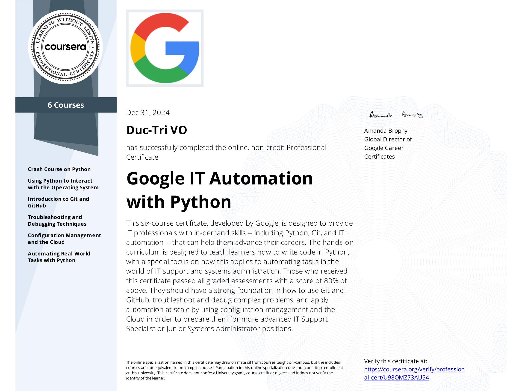

# Google IT Automation with Python
Approximately 6 months at 10 hours a week to complete!

Verify link: [Coursera.com](https://coursera.org/share/e07eedc514bc183fac8477f15b3d91b8)

This six-course certificate, developed by Google, is designed to provide IT professionals with in-demand skills -- including Python, Git, and IT automation -- that can help them advance their careers. The hands-on curriculum is designed to teach learners how to write code in Python, with a special focus on how this applies to automating tasks in the world of IT support and systems administration. Those who received this certificate passed all graded assessments with a score of 80% or above. They should have a strong foundation in how to use Git and GitHub, troubleshoot and debug complex problems, and apply automation at scale by using configuration management and the Cloud in order to prepare them for more advanced IT Support Specialist or Junior Systems Administrator positions.

### Course List:
1. Crash Course on Python  
2. Using Python to Interact with the Operating System  
3. Introduction to Git and GitHub  
4. Troubleshooting and Debugging Techniques  
5. Configuration Management and the Cloud  
6. Automating Real-World Tasks with Python

